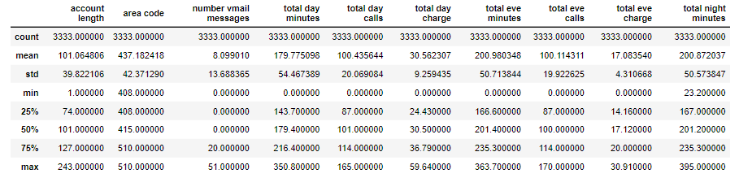
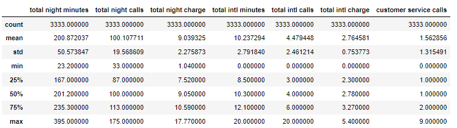
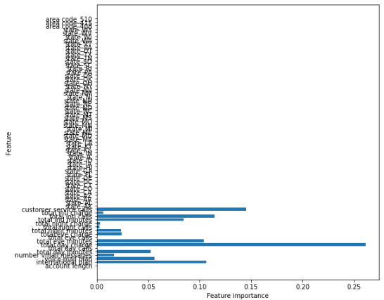

# TELECOM CHURN - WHAT'S THE HANG UP?
## Analysis of Syriatel Customer Data to Identify Churn
### Author: Andrew Bennett

## Project Overview (#business_case)
To aid Syriatel in their quest to limit churn, we analyzed data from 3333 users to determined any patterns showing why customers are leacing. This repository contains that analysis including all computer coding, databases, csv files, and other supporting documents. The purpose was to provide concrete recommendations that could be used to limit the effects of churn. Based on data from Kaggle (linked provided below) we used a Decision Tree model to determine the following reasons.

* Cost - 75% of customers who pay more than $74 will leave 
* Customer Service - roughly 50% of users with more than 3 call will leave 
* Internation Service - almsot 50% of International Service users leave

Syriatel needs to address these issues to limit churn.

## Business Case
Our client, Syriatel, is concerned with their "churn" or customer loss. They work hard to provide great service at a reasonable price, and while losing customers is inevitabe, it's still painful.

But how painful? Syriatel is looking for a deep dive into their data to determine the scope of the problem and some steps to resolve it. Are there any patterns? Can we predict which customers could be leaving "soon"?

Syriatel's churn case is a binomial classification problem. This means we're trying to determine which data contributes to a true/false or 1/0 determination. Luckily, we can build a model to determine that. We build it iteratively. First, we review and inspect the data, analyze it using 3 different modeling techniques, and then evaluate the results. From here, we re-evalute the data itself, and determine if there's any additional feature engineering or data cleaning. Then we would re-examine the results using our model of choice.

## Github Repository
This Repository Structure is straightfoward to use

#### Folder
    * Data Folder - data (zipped and unzipped) used for this work
    * Images Folder - image files you see here in this Readme, in the presentation
    * PDFs Folder - Jupter Notebook and Presentation as PDFs
#### Files
    * telecom_churn - the Jupyter Notebook with the active code
    * Readme - is... what you're reading now

## Readme Instructions
The various sections of the readme are outline below. Each Section is provided with a short summary and a link to more detailed description below.

## [Data Understanding](#data_understanding)
For this project, we are utilizing data from SyriaTel, made available on [Kaggle](https://www.kaggle.com/datasets/becksddf/churn-in-telecoms-dataset/), a popular data science hub.

Within the CSV file, there's information about individual cellular acounts. Fortunately our target column is called 'churn' and contain boolean variables. Our feature column has 20 columns, 4 of which are object types and the remaining are ints or floats. 

Our Target variable distribution shows 483 churns out of 3333 entries, or 15%. This suggests some class imbalance we may need to address, and a relatively high accuracy bar to climb. 

## [Data Preparation](#data_preparation)
In order to prep this data, we can first look at the quality of the data and realize a few things. First, we only have four categorical columns, the rest our numeric. Second, we have no null values. Amazing.

But we do have to convert these categorical columns. To do this, we're going to apply a little domain knowledge here. For starters, we know that phone numbers are assigned at random, and these should have no bearings on churn. So we've [dropped the phone numbers](#dropped_phone_numbers) from our dataset.

Next, we can [one hot encode](#one_hot_encode)the state and the area code. We also have voice mail and international plan as yes/no column, so we'll convert those columns to (1/0).

Finally, we will convert the target churn column from boolean to an integer (0/1).

## [Modeling](#modeling)
Our approach to modeling is to try 3 different modeling techniques to see which one yields the best early results. We utilized KNN, Logistic Regression, and Decision Tree. 

In each case, we trained the model on the same set of training data using default hyperparamters settings. The test results were evaluated, and the model rerun optimizing for the hyperparameters. The results were evaluated on train data with a cross-validation, to guard against overfit.

The model with the best results was the Decision Tree model, with the results of the test data shown below. This result included hypertuning and cross-validations sampling.

`Precision Score: 0.8969072164948454
Recall Score: 0.696
Accuracy Score: 0.9424460431654677
F1 Score: 0.7837837837837837`

## [Evaluation](#evaluation)
Now we have done some baseline modeling, we seemed to have settled on a Decision Tree approach which gives us some of best preliminary results. It's a good time to see what we have an tweak the model from there.

With decision tree, we can review a [features importanct plot](#features_plot). This tell us that the state and area code information has no importance. It tells us that the most important feature was the 'Total Day Charge'. The next most important was Customer Service Calls.

Thinking about these factors make sense intuitively, those people who talk on the phone a lot may have higher bills, and the most likely to quit. But... we don't have a feature for total charge. We have different categories of evening, daytime, and international charge, but no total. Let's verify that there is a flat charge for the different call rates.

Sampling - We're going to utilize the SMOTE technique on our data and train on models on that. This should increase our accuracy and limit and issues related to class imbalance.

## [Iteration](#iteration)
So, we removed the area code and state from our data and also confirmed the flat rates for our calls. We were able to consolidate all minute charges into one 'total charge category'.

From here we ran additional Decision Tree models with CV grid optimization and creaded our best pefroming model.

Our best performing model was a Decision Tree model with new, Feature Engineered Data.

<ins>DT Trial 1 - (train with hypertuning and cross-validation</ins>
`Precision Score: 0.990506329113924
Recall Score: 0.8505434782608695
Accuracy Score: 0.9767907162865146
F1 Score: 0.9152046783625729
Mean Cross Validation Score: 97.64%`

Whoa! Precision of 0.99, and accuracy of 97.6, with cross-validation of 97.6. These are amazing. Let's try it on the test-data.

<ins>DT Trial 2 - (test with hypertuning)</ins>
`Precision Score: 0.9805825242718447
Recall Score: 0.8782608695652174
Accuracy Score: 0.9808153477218226
F1 Score: 0.926605504587156`

A precision and accuracy score of 98% on our test data is strong. And this is comparable to our train and cross-validation data.

We tried additional SMOTE resampling, and other boosting models but the above was our ebst result.

## [Conclusion](#conclusion)
From our model we can conclude 3 major factors that drive Churn. We divided them into issue buckets.

Bucket 1 - Price - churn users who pay more than $74 a month and have no voicemail. 
Bucket 2 - Customer Service - churn users who pay less than $60 and have more than 3 customer service calls. 
Bucket 3 - International Service - churn users less than $74 who have international plans.

## Data Understanding 
For this project, we are utilizing data from SyriaTel, made available on [Kaggle](https://www.kaggle.com/datasets/becksddf/churn-in-telecoms-dataset/), a popular data science hub. 

### Obtaining Data
The data itself is a CSV file, so we can use some of our standard import methods to bring in the data. We will use the `read_csv` function to import it. 

### Data Inspection
This dataset appears to contain information about individual cellular accounts, with much of the information pertaining to day, night, evening, and international service usage and cost. There's also information on whether the account has a voicemail and international plan, as well as the length of the account. There's only a state, area code, and phone number that identifies the account. There's a colun for account length, but we don't know if this account data is a total, a monthly, or yearly information.

#### Features Type
We have 20 feature columns, 4 of which are objects. The rest are either int or floats. Fortunately our target column is called 'churn' and contain boolean variables. 

#### Target Variable Distribution
Our Target variable distribution shows 483 churns out of 3333 entries, or 15%. This suggests some class imbalance we may need to address, and a relatively high accuracy bar to climb.

#### Numeric Feature Statistics
The below tables shows a high level description for our numerical data.

As we can see there are no null data points.

#### Summary
A few high level summary items. We have: 
1 - boolean target (binary classification) 
20 - feature columns
3333 - total entries
4 - Object Data points.
No null data

There are 3333 total entries. Of our feature columns, 4 are objects. Of these 4 columns, they all feel relevant for our case, except for phone number. The other columns are floats or ints so we can process that appropriately. Additionally, we see that `'area code'` is an `int`. We know that area codes are really a description of a region, much like the `'state'` column, so we should probably treat that like a categorical. Our review of the states column shows that we have siginificant accounts from every state.

Just as a baseline, we've created some evaluation metrics to compare against other models. 

`Precision Score: 0.0
Recall Score: 0.0
Accuracy Score: 0.8550855085508551
F1 Score: 0.0`

As you can see, by just predicting that no customer's churn, or that all of the values could predicted to be 0, we have a high accuracy of nearly 86%. 

### Data Preparation 
Before we begin the modeling, we have to make sure our data is cleaned and ready for processing. So, to do this, we're going to drop the phone numbers, one hot encode our categorical data, and convert our boolean category to integers (0,1). We previously observed that we have no null values, so we don't have to fill any in.

#### Drop  Phone Numbers 
From our domain knowledge, we know that the last seven digits of a phone number are unique and assigned randomly. We don't want these numbers considered so we're going to drop them from our data set.

#### One Hot Encoding 
Now that we've dropped our phone number category, it's we can one hot encode our two remaning columns, which are `'state'`, `'area code'`, as well as `'international plan'` and `'voice mail plan'`. We can also convert our target column to 1/0 as well. To simplify, we'll do a binary converstion on `'international plan'` and `'voice mail plan'` to convert to 1/0 .

Great, so we've expanded our now let's convert the target from yes/no to 1/0.

#### Summary
We've now performed the one hot encoding for our categorical data, as well as removed the phone numbers from our data. We've also converted our target to 0,1s, so we should be ready to perform our train-test split, transform the data, and begin training our model.

### Modeling 
Now that we have cleaned our data, we can being to prepare it for preprocessing, transformation, and eventually modeling. We noted early that we have roughly 85% of our users who stay on our cellular plan, so we should account for the class imbalance here. As we noted above, o ur approach to modeling is to try 3 different modeling techniques to see which one yields the best early results. We utilized KNN, Logistic Regression, and Decision Tree. 

In each case, we trained the model on the same set of training data using default hyperparamters settings. The test results were evaluated, and the model rerun optimizing for the hyperparameters. The results were evaluated on train data with a cross-validation, to guard against overfit.

#### Train-Test Split and Scaling
To start, let's perform our train-test split. We use the standard parameters with a `test_size` of 0.25 and `random_state` of 42. Because we are doing KNN, we don't want any one feature to dominate our "distance calculations." We're going to perfrom standard scaling on our feature set to prep for KNN.

Perfect, now, to inspect the split I'll convert into a dataframe and confirm it looks okay. 

So, we have our scaled data set now. 

#### KNN
We'll set up a baseline KNN classifier with no pyrameters tuning to see what we get.

Now we have our model, let's see the results. We're going to use a variety of metrics here.

<ins>KNN Trial 1 - Train (no hypertuning nor cross-validation (CV))</ins>
`Precision Score: 0.9
Recall Score: 0.17597765363128492
Accuracy Score: 0.8791516606642658
F1 Score: 0.29439252336448596`

Precision score of 0.9 isn't bad, and the accuracy score has improved slight from 86%. Let's see how it looks on the test data.

<ins>KNN Trial 1 - Test (no hypertuning nor cross-validation (CV))</ins>
`Precision Score: 0.5333333333333333
Recall Score: 0.064
Accuracy Score: 0.8513189448441247
F1 Score: 0.11428571428571431`

Okay, so not as good. It looks like we got very lucky on our train data and overfit quite a bit. Let's see if we can find an optimal K-value that might improve things. We can run a loop to find it.

Those results for the optimal K are...
<ins>K-Optimization Trial 1:</ins>
`Best Value for k: 1
Accuracy-Score: 1.0`

Whoa! These results seem... off. It saying our best value for K is to test 1 neighbor and our Accuracy score is perfect.

Maybe we got lucky with our split. Let's rerun this optimzation loop but this time we will score with Cross validation.

<ins>K-Optimization Trial 2:</ins>
`Best Value for k: 7
Accuracy-Score: 0.8591430861723446`

Okay... this look more reasonable. Our optimal K value was 7 and our Accuracy was 85.9%. So, let's see how this performs on our test.

<ins>KNN Trial 2 - Test (with hypertuning and cross-validation (CV))</ins>
`Precision Score: 0.7857142857142857
Recall Score: 0.264
Accuracy Score: 0.8788968824940048
F1 Score: 0.3952095808383233`

This is an improvement from our baseline with a 78% precision score. However our F1 and Recall our quite low. It seems as though we still have trouble with False Negatives, meaning we need to identify more churn than we have. Let's move on to a different model and see if anything changes

#### Logistic Regression
Now let's try a logistic regression. To perform this, we're going to scale our model differently. Previously, we used a standard scaler with KNN. However, now with the Logistic Regression, we must used the MinMaxScaler to avoid negative numbers.

Let's go ahead and transform the data and then rerun it.

<ins>LR Trial 1 - Train (no hypertuning or cross-validation (CV))</ins>
`Precision Score: 0.6333333333333333
Recall Score: 0.26536312849162014
Accuracy Score: 0.8727490996398559
F1 Score: 0.37401574803149606`

Okay, so... at quick glance we did improve slightly on the Accuracy Score. Again, it's nothing... amazing. Perhaps we can iterate over a few options and find a good C, as well as a solver.

This time, instead of a custom optimizer, I'm going to use the GridSearchCV option. This loop is fairly time intensive, but the results are hopefully worth it.

Okay, let's check our accuracy here. I'm going to run the logistic regression, again with the new numbers.

<ins>LR Trial 2 - Train (with cross-validation (CV))</ins>
`Precision Score: 0.6595744680851063
Recall Score: 0.25977653631284914
Accuracy Score: 0.874749899959984
F1 Score: 0.37274549098196386`

Right, so only a marginal increase in accuracy and F1 score. Our precision score actually dropped, so this model doesn't feel appropriate for this data. We won't test against the test data, as our train data results are note great. 

#### Decision Tree
With decision tree, we're going to try without scaling and see what happens. We have our original training data so we can just use that. Additionally, we're going to add a cross validation score at the end to make sure our accuracy is okay, and to account for any overfitting that would naturally occur with a Decision tree.

<ins>DT Trial 1 - Train (with no hypertuning nor cross-validation (CV))</ins>
`Precision Score: 1.0
Recall Score: 1.0
Accuracy Score: 1.0
F1 Score: 1.0
Mean Cross Validation Score: 91.60%`

Whoa! We got a perfect score on our decision tree, with a mean cross validation accuracy of 91.48%. So, we're overfit with this particular model, but we have our highest accuract so far. This looks promising. Let's continue down this path and run a "quick" Grid CV and see what we can do with the current model and dataset. We can update a few of the hyper parameters and see if this improves. We know that decision trees tend to overfit.

<ins>Grid Optimization Test with CV</ins>
`{'criterion': 'gini',
 'max_depth': 6,
 'min_samples_leaf': 3,
 'min_samples_split': 2}`

Okay, that was an intensive loop. Let's take these results and run a new Decision Tree to see what we've got.

<ins>DT Trial 2 - Train (with hypertuning and cross-validation (CV))</ins>
`Precision Score: 0.9743589743589743
Recall Score: 0.7430167597765364
Accuracy Score: 0.9603841536614646
F1 Score: 0.8431061806656102
Mean Cross Validation Score: 93.88%`

Okay, this is promising. We have really strong scores here. Precision, Recall, and F1 are up across the board. 
The Decision tree appears to be the best "base" model, before any boosting or further feature engineering. Let's take a look at what features are prominent and re-examine the data from here. We have a mean cross validation score across our training data as 94.12%. This is almost a 9% increase over our 85%. Let's evaluate this in more depth.

Let's see the test data.

<ins>DT Trial 3 - Test (with hypertuning and cross-validation (CV))</ins>
`Precision Score: 0.8969072164948454
Recall Score: 0.696
Accuracy Score: 0.9424460431654677
F1 Score: 0.7837837837837837`

Okay, this is mixed. The precision number on our test data is 86%. This means, when our model predicts a churn, it still misses almost 13%, which isn't bad. Our recall shows that we have way more false negatives than we do false positives, but our overall accuracy is still at 94%, but let's go back to our original goal here. To predict and identify churn and make some recommendations to stop it. Let's evaluate this model and determine next steps.

### Evaluation 
Now we have done some baseline modeling, we seemed to have settled on a Decision Tree approach which gives us some of best preliminary results. It's a good time to see what we have an tweak the model from there.

Remember, our goal here is to determine why the churn is happening. An 89% precision rate means we've probably found something, however, we're still missing almost 10% of the true positives. It appears that we still have considerable amount of false negatives, but our overall accuracy is almost 94%, which is higher (an increase of 9%) than our original baseline accuracy.

It's important to consider the problem - churn. Churn means people want to leave their phone provider. We know that there will be some cases we can't predict, and it's likely we'll be battling a higher number of false negatives than false positives. Just think, people quit their phone service for a variety of reasons related to moving, employment, our life considerations that may not show up on the data. However, it might be nice to get more than a 10% increase in prediction here.

#### Sampling
In our final Decision Tree model, we had a cross validation accuracy of 94%. When we went to our test data, it went to roughly the same. This suggests that our model underfit, maybe, but not by much.

Let's compare the churn rate for our original data.

<ins>Original Data</ins>
`There a total of 3333 entries.
The percentage of users who churn is 14.49%.
We do have class imbalance concerns.
So... our model should have a higher accuracy than 85.51% at predicting who will stay.`

<ins>Train Data</ins>
`There a total of 2499 entries.
The percentage of users who churn is 14.33%.
We do have class imbalance concerns.
So... our model should have a higher accuracy than 85.67% at predicting who will stay.`

<ins>Test Data</ins>
`There a total of 834 entries.
The percentage of users who churn is 14.99%.
We do have class imbalance concerns.
So... our model should have a higher accuracy than 85.01% at predicting who will stay.`

These splits are reasonable - they each have a similar churn rate so there isn't much difference between them.

#### Sample and Data
As we noted in our original assessment, there are class imbalance concerns because we only have a churn rate of about 15%. We created our original train/test split and have been careful since then to use cross-validation to mitigate an overfitting, we could be missing something with a relatively small sample size to work with. One way to mitigate that would be using a SMOTE technique to create a new population for a train-test split, and then rerun our decision tree from there.

#### Modeling Techniques
We used three different modeling techniques to train on our data: KNN, Logistic Regression, and Decision Tree. With KNN and Logistic Regression, we only achieved small bumps in accuracy and F1. The Decision Tree with some hyperparamater tuning yielded more favorable results. Going forward, we'll use a Decision Tree on this data. The advantage with the Decision tree is we don't have to utilize much scaling and we can optimize later with Random Forests or other boosting.

#### Features 
So, we like our model, but how do we explain it. What features really drive the success of the model. To answer that question, let's review the feature importance and see what comes out.

Perfect. This graph tells us our important features. From here we can see that Total Day charge features most prominently but not far in front of the next feature, which is customer service calls. Thinking about these factors make sense intuitively, those people who talk on the phone a lot may have higher bills, and the most likely to quit. But... we don't have a feature for total charge. We have different categories of evening, daytime, and international charge, but no total.

Also, those who most call customer service a lot are probably disappointed with their service.

Also, of note, there's is little if any importance attached to the state, as well as the area code. It could be useful to delete these variables going forward in order to speed up processing time. And refocus the training of the models.

#### Summary
We reviewed the modeling techniques and well, we're moving on. We had the best preliminary results with the Decision Tree, so we will continue to utilize that model, and perhaps boost it later.

We're going to remove the state and Area Code features all together. We're going to create new feature which shows us the total charge, and perhaps convert the international call to a charge per minute number. We're going to remove the state and area code features all together, as they seem to have little effect.

Sampling - We're going to utilize the SMOTE technique on our data and train on models on that. This should increase our accuracy and limit and issues related to class imbalance.

So... let's give it a shot.

### Iteration 
Now that we've taken a first crack at the modeling, we need to adjust some things. We're going to do some feature engineering, some resampling, and then we will rerun our Decision Tree model, try resmapling with SMOTE, and try Gradientboosting and ADABoost methods to recieve the best outcome.

#### Features
Features. As we mentioned previously, we're going to do a little feature engineering. We may even violate some collinearity guidelines in the process. Who knows!

So, we're going to rexamine our original dataset, and remove state and area code altogether. Additionally, we're going to create a column called total charge. While we're at it, let's modify the evening charge to be a cost per to determine the average cost/minute to see if we can see anything there.

So, we can go back to the original data set and drop data, area, and phone number again.

Now, before we can consolidate all charges into one category, let's verify that it's a flat rate for all of the call tiers. 

Okay, so the standard rates ARE indeed flat as dollars. Evening rate is .085/min. Day rate is .17/min, Night is .045/min, Intl rate is .27/min. So we can go ahead and consolidate this into one charge.

Fantastic! It looks like we cleaned up this data... for now. A couple of takeaways, because the charges are a flat rate, it turns out the minutes and charges for each pricing tier are collinear. By combining the charges into one total charge, we've streamlined our data, solved potential collinearity issues, and have a more "customer-focused" column.

#### ReCreate Decision Tree Model
Let's do a new train-test split with the same size but a random_seed of 0. In essence, I'm restarting the entire analysis with new data so I'm going to reseed it as well.

To start, I'm going to optimize to find the best hyperparamters with cross-validation

<ins>Optimization Results:</ins>
`{'criterion': 'gini',
 'max_depth': 5,
 'min_samples_leaf': 4,
 'min_samples_split': 10}`

So, with these results, we're going to apply them to our Decision Tree Model

<ins>DT Trial 1 - (train with hypertuning and cross-validation</ins>
`Precision Score: 0.990506329113924
Recall Score: 0.8505434782608695
Accuracy Score: 0.9767907162865146
F1 Score: 0.9152046783625729
Mean Cross Validation Score: 97.64%`

Whoa! Precision of 0.99, and accuracy of 97.6, with cross-validation of 97.6. These are amazing. Let's try it on the test-data.

<ins>DT Trial 2 - (test with hypertuning and cross-validation</ins>
`Precision Score: 0.9805825242718447
Recall Score: 0.8782608695652174
Accuracy Score: 0.9808153477218226
F1 Score: 0.926605504587156`

Wow... These numbers are strong. 98% precision and 98% accuracy. F1 score of 92.7%. We have a recall score of 88% but remember, we're okay with a lower recall score because we accept they'll be a few stray churns. Let's take a look at our decision tree visualizaiton.

Interesting that we see that total charge is the most defining feature. This is one we had to engineer, but it's clearly very indicative. After that we have customer service, voice mail, and then a variety of internation service features.

#### SMOTE 

We talked about imbalance before, and ways to address it. We know our churn rate is only 15%. So let's create a more even sample size using a synthetic minority oversampling technique. You want this SMOTE? To do this, I'm create a brand new train-test set, prior to the synthetic creation. We will verufy that the split has a similar churn rate at 15%

`1    1603
0    1593
Name: churn, dtype: int64`

Aha! This looks good. We have a 50-50 split, and approximately 3200 piece of data, but now with a 50-50 split.

#### Decision Tree with CVGrid.

Now that we have a more complete model, it's a good opportunity to rerun a decision tree with a CV grid and scope out the goods. With our new sampling, let's run a new optimazation loop to hypertune our decision tree with our new SMOTE sample.

<ins>CV GRID Results:</ins>
`{'criterion': 'gini',
 'max_depth': 6,
 'min_samples_leaf': 2,
 'min_samples_split': 2}`

Okay, these results are similar to the ones we had previously. Except we used 'gini' before.

<ins>Decision Tree Train Data with Smote Sample</ins>
`Precision Score: 0.9165457184325109
Recall Score: 0.7878976918278229
Accuracy Score: 0.8576345431789737
F1 Score: 0.8473666554847368

Mean Cross Validation Score: 85.32%`

This is very strong. Recall that, with our new SMOTE data, we had a roughly 50-50 chance of predicting churn. We achieved a precision score of nearly 100%, with an accuracy score of 89%... this is 39% higher than 50%. This is a strong performance on 50-50 data. Let's try this new model out now on some of our original training data, still using the information from our SMOTE sample.

<ins>Decision Tree Test Data with Smote Sample</ins>
`Precision Score: 0.926605504587156
Recall Score: 0.8782608695652174
Accuracy Score: 0.973621103117506
F1 Score: 0.9017857142857143`

This is good, but actually not as good as what we previously achieved. We have 97.1% accuracy with both an F1 score of 89%. Our recall improved, but remember, we probably care more about precision than we do recall. Precision dropped significantly. What's interesting here is that SMOTE, did not improve our score.

`Precision Score: 0.5459459459459459
Recall Score: 0.8782608695652174
Accuracy Score: 0.882494004796163
F1 Score: 0.6733333333333333`

This is good, but actually not as good as what we previously achieved. We have 97.1% accuracy with both an F1 score of 89%. Our recall improved, but remember, we probably care more about precision than we do recall. Precision dropped significantly. What's interesting here is that SMOTE, did not improve our score. Let's take a look at the tree it produced.

Now let's try some additional booster

#### Other Boosters, Adaboost and Gradient Boosting

Adaboost
`Precision Score: 0.14285714285714285
Recall Score: 0.08695652173913043
Accuracy Score: 0.802158273381295
F1 Score: 0.1081081081081081`

Gradient Boosting
`Precision Score: 0.12244897959183673
Recall Score: 0.10434782608695652
Accuracy Score: 0.7733812949640287
F1 Score: 0.11267605633802817`

After we've review this, we can tell that our `dt_clf_2` model is really our strongest.

#### Summary
Now that we've completed a fair bit of iteration modeling, we've stumbled upon a fairly precise and accurate model. Our `dt_clf_2` model on the newly updated data set. Let's recap.

We updated our features to get rid of the area codes and state features. We also combined all of the charges into one, total charge. This eliminated some collinearity concerns, and also produced a, strong, customer relevant feature.

We continued using our Decision Tree Model, and reran it on the new data. We got some of our best numbers, with precision and accuracy numbers at 98% for test data, and 100% and 98%, respectively for training data. Total customer charge turned out to be our primary feature on our decision tree, with the boudary of <=74.04.

Our other models, did not produce results as impressive. We attempted to resample the data by creating synthetic data points to achieve a 50-50 churn rate. By running a decision tree model here, we thought we could produce better results, which didn't happen. Furthermore, other methods Adaboost and Gradient Boosting didn't produce results better than our straightforward Decision Tree model on.

## Conclusion 

So, we've got some positive results with which to analyze this model. Remember, we did a little feature engineering to create a column called total charge, and that turned out to be our most important feature with regard to predicting outcome. This makes sense when we think of our business problem - why are we losing customers? Well, maybe the biggest predictor is how much they pay. Let's do a deeper dive into our model tree to see what's going on.

What we can gather from here our really 5 positive churn leaves representing unique cases. 

#### Analysis

We have one leaf representing total_charge > 74.04 and no voicemale plan. This has 159 occurences, or almost half of the churned customers in our training data. We don't know much about a voice male plan, but it's safe to say this user base has high engagement with the product, but it budget constrained for whatever reason. Love to talk but don't want to pay, and maybe will price shop. We need to figure out how to keep these high rollers happy!

Next we have 87 churned users who's total charge is less than 56.01, but has 4 or more customer service calls. That's about 25% of the churned base. These users are not happy with the servcice, and are not engaged. Perhaps we don't chase this group.

Next we have 37 churned who pay less than 74.04, have 3 or fewer customer service calls, have the internation plan but make fewer than 3 calls a month. So, this is an issue of low engagement - people with international plans who aren't using it. Hey! call your mom people!

Next we have 24 churned users who pay less than 74.04, have 3 or fewer customer service calls, and make more than 3 international calls with greater than 13 minutes. Safe to say this is the budget concious international crew. The have strong engagement and perhaps don't want to pay for the service they use. This could be a group we care about but represents

Then, in a very small bucket, we have approximately 5 users who pay more than 74.04 a month and have the voicemail plan, the international plan, and have a lenghthy account. This is such a small user base and not clear what the motivation is. That we can probably ignore it for now.

But, if we really consider this, we realize that the smallest bucket 5, contains only 5 users. This isn't a large enough bucket to make any determination. Additionally, Buckets 3 and 4 are really driven by the same core issue - International Users.

So we really have 3 drivers 

#### Original Data
Now that we have all of this information, let's abandon the model altogether and just look at data that we can filter based on this model. In doing so, we identify the 3 buckets below.

Bucket 1 are all of the churn users who pay more than $74 a month and have no voicemail. 
Bucket 2 are all of the users who pay less than $60 and have more than 3 customer service calls. 
Bucket 3 are those users less than $74 who have international plans.

#### Price
When we create a histogram of all of our users, we can see the a siginificant drop off at $74 of total charge.

Additionally, of those we lose at this higher spend we see that of the people who churn at over $74, none of them have a voicemail plan.

#### Customer Service
If we can isolate cost, let's only look at the people who are not affected by cost. Let's say, users who pay below $60. This is bucket 2, and it shows us that the affect of Customer Service.

The graph below shows the percentage of people who quit by customer service calls.

#### International Service

International Service, we can see that roughly 42% of our international users churn. We don't need a graph to show this. This is obvious.

As we can see, there's a disturbing peak in the data as the monthly bill increases. Once we hit a certain threshold in monthly spend, we're at a high risk of losing users. Let's take a closer look at the buckets here.