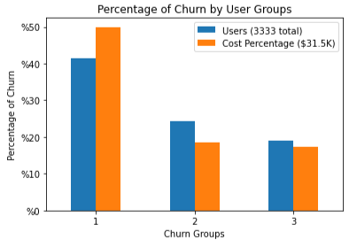
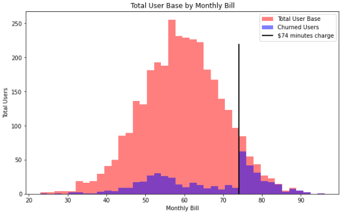
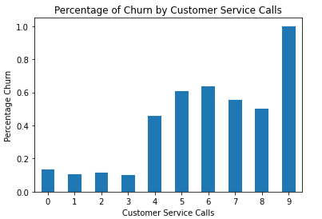

# TELECOM CHURN - WHAT'S THE HANG UP?
Analysis of Syriatel Customer Data to Identify Churn

  

## Project Overview (#business_case)
To aid Syriatel in their quest to limit churn, we analyzed data from 3333 users to determined root causes for why their customers are leaving. The churn rate is about 15%. Determining root cause will infrom Syriatel of potential weak spots in their service and shore up revenue. To perform this analysis, a publically available dataset in [Kaggle](https://www.kaggle.com/datasets/becksddf/churn-in-telecoms-dataset/) was utilized. Extracting, transforming and cleaning, the data, our model reviewed three different machine learning methods, with a Decision Tree algorithm providing the best results. 

The following were the root causes which identifies more than 85% of total churn.
* Cost - once a bill is greater than $74, 75% of customers leave 
* Customer Service - roughly 50% of users with more than 3 service call quit 
* Internation Service - almost 50% of International Service users discontinue their service.

Syriatel can remedy this by providing promotions for users with high phone bills, adding incentives for users making their third customer service call, and reviewing the viability of thier international plan.

## Table of Contents TOC
[Business Case](#business-case) 
[Data Understanding](#data-understanding) 
[Data Preparation](#data-preparation) 
[Modeling](#modeling) 
[Evaluation](#evaluation) 
[Key Findings](#key-findings) 
[Summary](#summary) 
[Github Repository](#github-repository) 

## Business Case
Our client, Syriatel, is concerned with their "churn" or customer loss. They work hard to provide great service at a reasonable price, and while losing customers is inevitabe, it's still painful. According to this dataset, they've lost almost 500 users (15% of total user base), accounting for roughly $31.5k in revenue.
 [return to TOC](#table-of-contents-TOC)

## Data Understanding
### Obtaining Data
For this project, we are utilizing data from SyriaTel, made available on [Kaggle](https://www.kaggle.com/datasets/becksddf/churn-in-telecoms-dataset/), a popular data science hub. The data itself is a CSV file, so we can use some of our standard import methods to bring in the data. 

### Data Inspection
This dataset appears to contain information about individual cellular accounts, with much of the information pertaining to day, night, evening, and international service usage and cost. There's also information on whether the account has a voicemail and international plan, as well as the length of the account. There's only a state, area code, and phone number that identifies the account. There's a column for account length, but we don't know if this account data is a total, a monthly, or yearly information.

#### Features Type
We have 20 feature columns, 4 of which are objects. The rest are either int or floats. Fortunately our target column is called 'churn' and contain boolean variables. 

#### Target Variable Distribution
Our Target variable distribution shows 483 churns out of 3333 entries, or 15%. This suggests some class imbalance we may need to address.
 [return to TOC](#table-of-contents-TOC)

## Data Preparation
To prepare this data, we noted the following observations. First, we only have four categorical columns, the rest our numeric. Second, we have no null values. Therefor, we performed the following transformations.

#### Drop  Phone Numbers
From our domain knowledge, we know that the last seven digits of a phone number are unique and assigned randomly. We don't want these numbers considered so we're going to drop them from our data set.

#### One Hot Encoding
Now that we've dropped our phone number category, it's we can one hot encode our two remaning columns, which are `'state'`, `'area code'`, as well as `'international plan'` and `'voice mail plan'`. We can also convert our target column to 1/0 as well. To simplify, we'll do a binary converstion on `'international plan'` and `'voice mail plan'` to convert to 1/0 .

#### Target Integer conversion from Boolean
We convert the target churn column from boolean to an integer (0/1).
 [return to TOC](#table-of-contents-TOC)

## Modeling
Syriatel's churn case is a binomial classification problem. This means determing what contributes to a true/false determination. Our approach is to try 3 different binary classification modeling techniques to see which yields the best results. We utilized KNN, Logistic Regression, and Decision Tree.

In each case, we trained the model on the same set of training data using default hyperparamters settings. The test results were evaluated, and the model rerun optimizing for the hyperparameters. The results were evaluated on train data with a cross-validation, to guard against overfit.

The model with the best results was the Decision Tree model, with the results of the test data shown below. This result included hypertuning and cross-validations sampling. The results are shown below.

Precision Score: 0.8969072164948454 
Recall Score: 0.696 
Accuracy Score: 0.9424460431654677 
F1 Score: 0.7837837837837837 
 [return to TOC](#table-of-contents-TOC)

## Evaluation
Now we have done some baseline modeling, we seemed to have settled on a Decision Tree approach which gives us some of best preliminary results. It's a good time to see what we have an tweak the model from there.

With decision tree, we can review which features are important. This tell us that the state and area code information has no importance. It tells us that the most important feature was the 'Total Day Charge'. The next most important was Customer Service Calls.

Thinking about these factors make sense intuitively, those people who talk on the phone a lot may have higher bills, and the most likely to quit. But... we don't have a feature for total charge. We have different categories of evening, daytime, and international charge, but no total. Let's verify that there is a flat charge for the different call rates.

Sampling - We're going to utilize the SMOTE technique on our data and train on models on that. This should increase our accuracy and limit and issues related to class imbalance.

So, we removed the area code and state from our data and also confirmed the flat rates for our calls. We were able to consolidate all minute charges into one 'total charge category'.

From here we ran additional Decision Tree models with CV grid optimization and created our best peforming model. It was the Decision Tree with new Feature Engineered Data

<ins>DT Trial 1 - (train with hypertuning and cross-validation</ins>
Precision Score: 0.990506329113924 
Recall Score: 0.8505434782608695 
Accuracy Score: 0.9767907162865146 
F1 Score: 0.9152046783625729 
Mean Cross Validation Score: 97.64% 

We can see a precision of 0.99, and accuracy of 97.6, with cross-validation of 97.6. This is promising on the training data. On the testing data, we have the following

<ins>DT Trial 2 - (test with hypertuning)</ins>
Precision Score: 0.9805825242718447 
Recall Score: 0.8782608695652174 
Accuracy Score: 0.9808153477218226 
F1 Score: 0.926605504587156 

A precision and accuracy score of 98% on our test data is strong. And this is comparable to our train and cross-validation data.

We tried additional SMOTE resampling, and other boosting models but the above was our best result. Our SMOTE techniques did not reveal a better result.
 [return to TOC](#table-of-contents-TOC)

## Key Findings

Now that we have all of this information, there are three key findings that we'll call "churn buckets"

Bucket 1 are all of the churn users who pay more than $74 a month and have no voicemail. 
Bucket 2 are all of the users who pay less than $60 and have more than 3 customer service calls. 
Bucket 3 are those users less than $74 who have international plans.

#### Price
When we create a histogram of all of our users, we can see the a siginificant drop off at $74 of total charge.

Additionally, of those we lose at this higher spend we see that of the people who churn at over $74, none of them have a voicemail plan.

#### Customer Service
If we can isolate cost, let's only look at the people who are not affected by cost. Let's say, users who pay below $60. This is bucket 2, and it shows us that the affect of Customer Service.

The graph below shows the percentage of people who quit by customer service calls.

#### International Service

International Service, we can see that roughly 42% of our international users churn. We don't need a graph to show this. This is obvious.

As we can see, there's a disturbing peak in the data as the monthly bill increases. Once we hit a certain threshold in monthly spend, we're at a high risk of losing users. Let's take a closer look at the buckets here.
 [return to TOC](#table-of-contents-TOC)

## Summary
From our model we can see again the following 3 root causes that drive the the majority of churn. This model came from a machine algorithm look at 483 churn instances among 3333 users. To transform the data, we updated our features to get rid of the area codes and state features. We also combined all of the charges into one, total charge. This eliminated some collinearity concerns, and also produced a, strong, customer relevant feature.

We continued using our Decision Tree Model, and reran it on the new data. We got some of our best numbers, with precision and accuracy numbers at 98% for test data, and 100% and 98%, respectively for training data. Total customer charge turned out to be our primary feature on our decision tree, with the boudary of <=74.04.

Our other models, did not produce results as impressive. We attempted to resample the data by creating synthetic data points to achieve a 50-50 churn rate. By running a decision tree model here, we thought we could produce better results, which didn't happen. Furthermore, other methods Adaboost and Gradient Boosting didn't produce results better than our straightforward Decision Tree model on.

### Root Cause Review

As these effect Syriatel's revenue, it's imperative to implement steps to resolves these issues.

Churn Group 1 - Price - churn users who pay more than $74 a month and have no voicemail. 
Churn Group 2 - Customer Service - churn users who pay less than $60 and have more than 3 customer service calls. 
Churn Group 3 - International Service - churn users less than $74 who have international plans.

### Recommendations & Next Steps
#### Churn Group 1 - Price
Syriatel is losing some of their highest paying customers, which is not good. Syriatel should keep these customers by offering perks for those who spend over the $74 threshold. It could be extra minutes, for instance, or other benefits to keep people from leaving.

#### Churn Group 2 - Customer Service
Customer service is critical for any business, and fortunately for Syriatel they have a patient use base. But that only goes until the the 3rd customer service call. After that, users leave. To remedy this, 

#### Churn Group 3 - Customer Service
Increase awareness around calorie counting. It's hard at first but then it becomes second nature. It's very helpful to track what one eats.
 [return to TOC](#table-of-contents-TOC)

## Github Repository
To navigate this Github repository - note the file structure below

#### Folder
    * Data Folder - data (zipped and unzipped) used for this work
    * Images Folder - image files you see here in this Readme, in the presentation
    * PDFs Folder - Jupter Notebook and Presentation as PDFs
#### Files
    * telecom_churn - the Jupyter Notebook with the active code
    * Readme - is... what you're reading now
